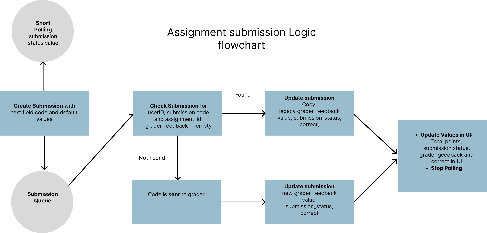

# Key design decisions

## Architecture

The web app follows a modular architecture, consisting of the following key components:

1. **User Interface (UI) - programming-ui:** The front-end of the application is built using the Astro + Svelte framework combination. It provides a responsive and intuitive user interface for seamless navigation and interaction. The design of the UI is made using Tailwind.
    
2. **Backend Server - programming-api:** The backend server is implemented using Deno and It handles requests from the UI, processes data, and interacts with the database.
    
3. **Database:** The web app utilizes a relational database management system (RDBMS)  PostgreSQL to store and manage assignments and submissions.

4. **API Endpoints:** The backend server exposes various RESTful API endpoints to handle operations such as, finding assignments, adding & updating submissions 
    
6. **Submission logic flow chart (below)** 

# Improvements ideas

## Functionalities
* Possibility to create new assignments
* Grader image for different programming languages
## User Interface
* Possibility to personalize the theme
## Performance
* Optimizing the loading of the assignment page